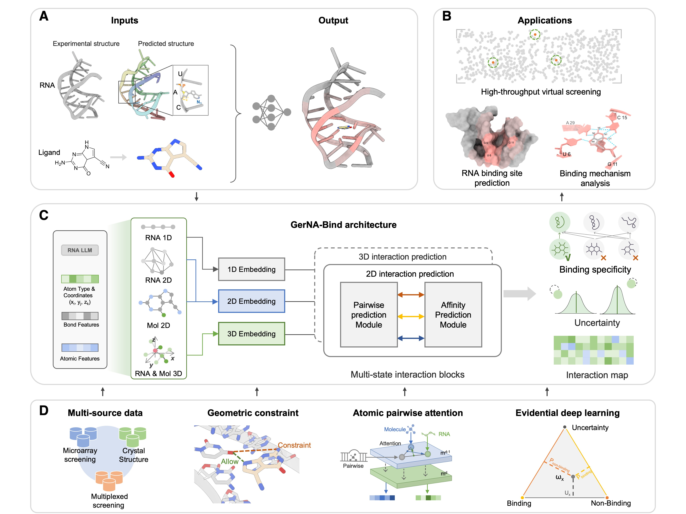

# GerNA-Bind: Geometric-informed RNA-ligand Binding Specificity Prediction with Deep Learning

✨ Welcome to the official repository for "GerNA-Bind: Geometric-informed RNA-ligand Binding Specificity Prediction with Deep Learning". This work is a collaborative effort by [Yunpeng Xia](https://github.com/DoraemonXia), [Jiayi Li](https://github.com/JiayiLi21), Chu Yi-Ting, [Jiahua Rao](https://scholar.google.com/citations?user=zeTuIZ4AAAAJ&hl=zh-CN), Chen Jing, [Will Hua](https://github.com/WillHua127), [Dong-Jun Yu](https://csbio.njust.edu.cn/djyu_en/), [Xiucai Chen](https://teacher.gdut.edu.cn/chenxiucai/en/jsxx/234857/jsxx/jsxx.htm), and [Shuangjia Zheng](https://zhenglab.sjtu.edu.cn/index.php) from Shanghai Jiaotong University.

<!-- 🔗 Read our paper: [ArXiv](https://arxiv.org/abs/****.*****) -->

## Overview

🚀 We introduce GerNA-Bind, a geometric deep learning framework that excels in predicting RNA-ligand binding specificity by integrating multi-modal RNA-ligand representations. GerNA-Bind achieves state-of-the-art performance, successfully identifying 19 compounds binding to oncogenic MALAT1 RNA through high-throughput screening. Wet-lab validation confirmed three compounds with submicromolar affinities, showcasing its potential for advancing RNA-targeted drug discovery.



## 🗂 Contents

- [Installation](#installation)
<!-- - [Data Preparation](#data-preparation)
- [Generate RNA Structure](#generate-rna-structure) -->
- [Data Preparation](#data-preparation)
  - [Dataset Description](#dataset-description)
  - [Generate RNA Structure](#generate-rna-structure)
  - [Data Processing](#data-processing)
  - [Dataset Download](#dataset-download)
- [Using GerNA-Bind](#using-gerna-bind)
  - [Model Training](#model-training)
  - [CheckPoints](#checkpoints)
  - [RNA Small Molecule Screening](#rna-small-molecule-screening)
  - [RNA Target Binding Site Prediction](#rna-target-binding-site-prediction)
<!-- - [Citation](#citation) -->
- [Acknowledgements](#acknowledgements)

## Installation
### If you prefer a faster setup, you can use the provided gernabind.yaml file:
```bash

conda env create -f gernabind.yaml -y
conda activate gernabind

```

### You can also install the environment either by following the step-by-step instructions below.
```bash
# Create a conda environment
conda create -y -n gernabind python=3.8
conda activate gernabind

#conda install pytorch==2.0.1 torchvision==0.15.2 pytorch-cuda=12.2 -c pytorch -c nvidia
pip install torch==2.1.0 torchvision==0.16.0 torchaudio==2.1.0

# Install other dependencies 
pip install rna-fm==0.2.2
pip install ml_collections==0.1.1
pip install simtk==0.1.0
pip install openmm==8.1.1
pip install torchdrug==0.2.1
pip install torch_geometric==2.4.0
pip install equiformer-pytorch
pip install edl_pytorch==0.0.2
pip install rdkit==2023.9.5
pip install biopython==1.79
pip install pandas==1.5.3
pip install scikit-learn==1.2.2
pip install prody==2.4.1
```

<!--```bash
if you have problem like this error information: ImportError: cannot import name 'packaging' from 'pkg_resources' (/xcfhome/ypxia/anaconda3/envs/gernabind/lib/python3.8/site-packages/pkg_resources/__init__.py) with torchdrug, you can try this command below:
pip install --upgrade packaging
pip install --upgrade pip setuptools
```
-->

## Data Preparation
### Dataset Description
Refer to the following guides for setting up datasets:
- RNA-Small Molecule Screening datasets: [Robin](https://pubmed.ncbi.nlm.nih.gov/36584293/) and [Biosensor](https://pmc.ncbi.nlm.nih.gov/articles/PMC9477273/)
- RNA-Ligand Complex Structure datasets: [Hariboss](https://hariboss.pasteur.cloud/)

### Generate RNA Structure
We use [RhoFold+](https://github.com/ml4bio/RhoFold) to generate RNA 3D Structure and [RNAfold](https://github.com/ViennaRNA/ViennaRNA/releases) (version: 2.5.1) to generate RNA 2D structure.

### Data Processing
You can process data through the following steps:
```bash
python data_utils/process_data.py --fasta example/a.fasta --smile example/mol.txt --RhoFold_path your_RhoFold_project_path --RhoFold_weight RhoFold_model_weight_path
```
And the processed data will be saved in ./data folder as "new_data.pkl" file.

### Dataset Download
We process the processed data with Robin & Biosensor dataset. You can download the processed data from [Zenodo](https://zenodo.org/records/14808549).

## Using GerNA-Bind
### Model Training
We provide the training scripts that you can train the model yourself.
```bash
python train_model.py --dataset Robin --split_method random --model_output_path Model/
```

### CheckPoints
Download the model weights and put into the "Model" folder, which contains the model checkpoint. You can direct run the scripts in ./Model folder to ger the model weights.

```bash
bash Model/get_weights.sh
```

<!-- #### Process Data -->

<!-- ```bash
python test_model.py --checkpoint model_weight
``` -->


<!--

In file included from RNA_wrap.cpp:764:
/xcfhome/ypxia/anaconda3/envs/gernabind/lib/perl5/5.32/core_perl/CORE/perl.h:861:13: fatal error: xlocale.h: No such file or directory
  861 | #   include <xlocale.h>
      |             ^~~~~~~~~~~
compilation terminated.
make[3]: *** [Makefile:733: RNA_la-RNA_wrap.lo] Error 1
make[3]: Leaving directory '/xcfhome/ypxia/resource/ViennaRNA-2.5.1/interfaces/Perl'
make[2]: *** [Makefile:640: all-recursive] Error 1
make[2]: Leaving directory '/xcfhome/ypxia/resource/ViennaRNA-2.5.1/interfaces'
make[1]: *** [Makefile:688: all-recursive] Error 1
make[1]: Leaving directory '/xcfhome/ypxia/resource/ViennaRNA-2.5.1'
make: *** [Makefile:579: all] Error 2
(gernabind) [ypxia@f146 ViennaRNA-2.5.1]$ ./configure --prefix=/xcfhome/ypxia/local/ViennaRNA-2.5.1 --disable-openmp --enable-universal-binary --enable-sse --with-python3 --without-perl

-->

### RNA Small Molecule Screening
You can use our model to screening small molecules which can binding target RNA.
```bash
python inference_affinity.py
```


<!-- First, you need to offer the .pdb file which include RNA pdb file and . -->
### RNA Target Binding Site Prediction
Otherwise, you can also use our model to get RNA target binding sites prediction.
You can run the file below, so that you can get the RNA_binding.csv about RNA.

```bash
python inference_binding_site.py
```

## License
No Commercial use of either the model nor generated data, details to be found in license.md.

<!-- ## Citation
🤗 If you find our code useful or our work relevant, please consider citing:

```
@article{gerna2025,
  title={GerNA-Bind: Geometric-informed RNA-ligand Binding Specificity Prediction with Deep Learning},
  author={Yunpeng Xia, Jiayi Li, Jiahua Rao, Dong-Jun Yu, Xiucai Chen and Shuangjia Zheng},
  journal={arXiv preprint arXiv:****.*****},
  year={2025}
}
``` -->

## Acknowledgements

Our work builds upon [EquiFormer](https://github.com/atomicarchitects/equiformer), [Evidential Deep Learning](https://github.com/aamini/evidential-deep-learning), [MONN](https://github.com/lishuya17/MONN), [RNA-FM](https://github.com/ml4bio/RNA-FM), [RhoFold](https://github.com/ml4bio/RhoFold), and [TankBind](https://github.com/luwei0917/TankBind). Thanks for their excellent work and open-source contributions.