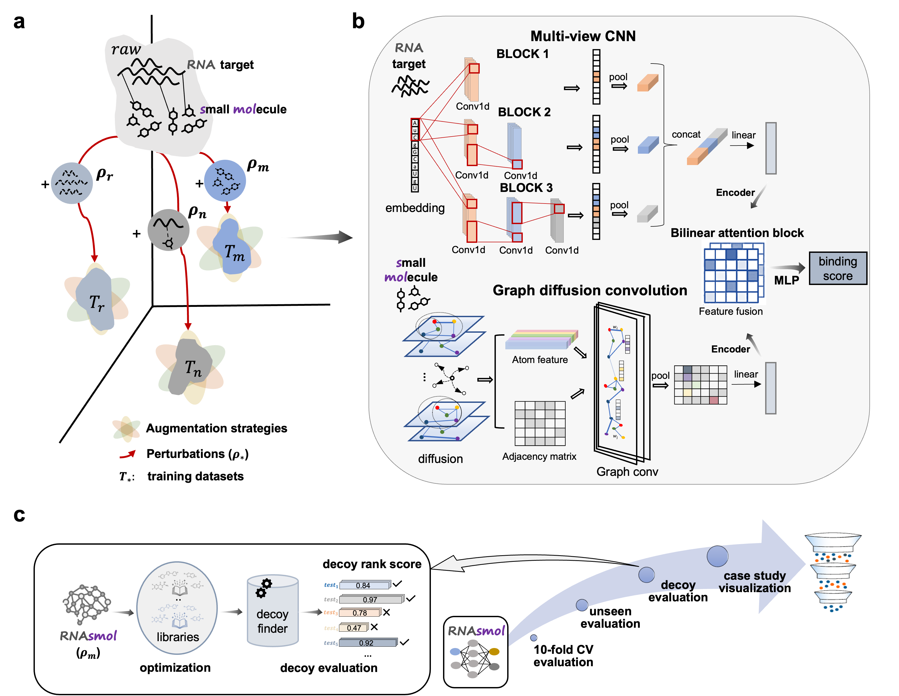
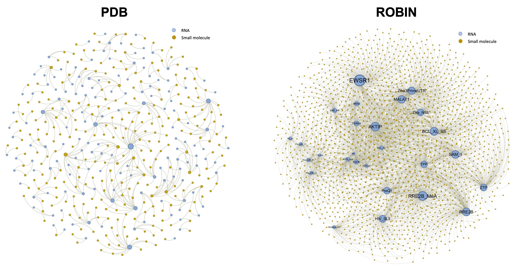
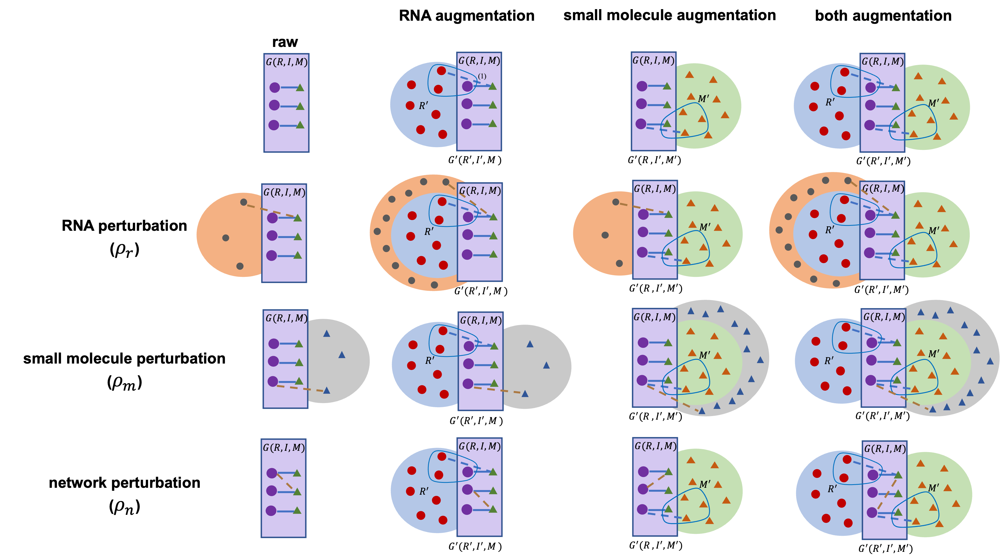

<h1 align="center">

RNAsmol 

</h1>
  <p align="center">
    RNA-ligand interaction scoring via data perturbation and augmentation modeling
  </p>
</p>


[](https://www.python.org/) [](https://pytorch.org/)  
[](https://colab.research.google.com/drive/14CRDxml2PYnI1aArxOmuMtaag5AXyRTq?usp=sharing) [](https://doi.org/10.5281/zenodo.15331693)

## Overview

<br />
<p align="center">
  <a href="https://github.com/hongli-ma/RNAsmol">
    
  </a>

## Getting started

### Prerequisites

* This project was carried out on eight 32GB V100 NVIDIA GPUs for model training and multiple 80-core CPUs for multi-threaded preprocessing.
* Key requirements: rdkit, torch-geometric, networkx
* Software/API used in this project: PyMOL, LigPlot+

### Environment

Clone the repo and create the evironment for RNAsmol.

``` bash
#Clone the RNAsmol repository from GitHub
git clone https://github.com/hongli-ma/RNAsmol.git
cd ./RNAsmol
#Install the required dependencies
conda env create -n rnasmol -f RNAsmol.yml
```

## Data perturbation with augmentation

### Glimpse of two filtered RNA-ligand networks

<br />
<p align="center">
  <a href="https://github.com/hongli-ma/RNAsmol">
    
  </a>

* RCSB Protein Data Bank (PDB) database: https://www.rcsb.org/
* Repository Of Binders to Nucleic acids (ROBIN) dataset: https://github.com/ky66/ROBIN
<br />
PDB RNA-ligand complex filtering:<br />
  (1) https://github.com/lkmoeller/rna_binding/blob/main/rna_binding/data_preparation/rna_data_prep.py<br />(2) https://github.com/hongli-ma/RNAsmol/blob/main/scripts/extract_pdb_binding_pocket.py<br />(3) https://github.com/hongli-ma/RNAsmol/blob/main/scripts/pocket_res_analyse.py<br />

### Method framework

<br />
<p align="center">
  <a href="https://github.com/hongli-ma/RNAsmol">
    
  </a>

### Databases and tools involved in perturbation and augmentation

* Diverse ChemBridge BuildingBlocks (chbrbb) library: https://zinc12.docking.org/catalogs/chbrbb 
* filtered BindingDB protein binder library: https://drive.google.com/file/d/16XztVAf6qHYUeXEtnGUxDxhsFuFAdTD2/view?usp=drive_link (Note: label 1 are rnabinder in ROBIN, label 0 are proteinbinder in BindingDB)
* the COlleCtion of Open NatUral producTs (COCONUT) library: https://coconut.naturalproducts.net/
* filtered ZINC in-vitro bioactive compound library: https://drive.google.com/file/d/1VxrGt0-iI5q_VoYU0PFNRzZzxPrDUK30/view?usp=drive_link
* Ligand ID-smiles in PDB structures: https://drive.google.com/file/d/1TUqV_IY4u5M00MpUHB_QuMZr0hDi9e-M/view?usp=drive_link 
<br />

* A genomic catalog of Earth’s microbiomes (GEMs): https://genome.jgi.doe.gov/portal/GEMs/GEMs.home.html
* Unified Human Gastrointestinal Genome (UHGG) collection: https://www.ebi.ac.uk/metagenomics
* The NIH Human Microbiome Project phase 2 (HMP2): https://portal.hmpdacc.org/ 
* TARA Oceans Metagenomes: https://merenlab.org/data/tara-oceans-mags/
* Tibetan Glacier Genome and Gene (TG2G) catalog: https://ngdc.cncb.ac.cn/gsa/browse/CRA011511
* RNAcentral: The non-coding RNA sequence database: https://rnacentral.org/
* The Nucleotide database of NCBI: https://www.ncbi.nlm.nih.gov/nucleotide/
* Rfam database: https://rfam.org/ 
<br />

* Infernal: https://github.com/EddyRivasLab/infernal 
* rMSA: https://github.com/pylelab/rMSA
* dinuclShuffle: https://github.com/hongli-ma/RNAsmol/blob/main/scripts/dinuclShuffle.py
* RNAfold: https://github.com/hongli-ma/RNAsmol/blob/main/scripts/run_rnafold.py

Please refer to the scripts folder to reproduce the perturbations and augmentations, order: augmentation -> perturbation -> RNAfold<br /> All processed datasets are also provided (see Evaluation section). 

## Implementation

To get started more quickly, please refer to the demo notebook of the model: [RNAsmol_demo.ipynb](https://github.com/hongli-ma/RNAsmol/blob/main/RNAsmol_demo.ipynb)

### 1.Activate the created conda environment

```
source activate rnasmol
```

### 2. Data preprocessing

```         
python rnasmol/preprocessing.py pdb_rnaperturbation  
```

### 3. Model training

```         
python rnasmol/train.py --dataset pdb_rnaperturbation  --lr 5e-5 --batch_size 1024 --save_model
```

### 4. Model test

``` text
python rnasmol/test.py --dataset pdb_rnaperturbation  --model_path 'saved_model/*.pt'
```

  
## Evaluation

### 1. Classification
* All processed datasets for classification task are provided:
* Datasets without augmentations: https://github.com/hongli-ma/RNAsmol/tree/main/rnasmol/data  
* Augmented datasets: https://drive.google.com/file/d/18pYf7ZgL1F9WzrLB1z1Kq5br4Q9s1C_1/view?usp=drive_link

### 2. Decoy

* Generate datasets using decoyfinder: https://github.com/hongli-ma/RNAsmol/blob/main/scripts/modified_decoyfinder.py
* Case study decoy test sets: https://github.com/hongli-ma/RNAsmol/tree/main/rnasmol/data 
* fr3d files used in RNAmigos and RNAmigos2: https://www.bgsu.edu/research/rna/software/fr3d.html

## Citation
* Ma, H., Gao, L., Jin, Y. et al. RNA–ligand interaction scoring via data perturbation and augmentation modeling. Nat Comput Sci (2025). 
* doi: https://doi.org/10.1038/s43588-025-00820-x
* Complimentary sharing full-text (free and view-only): https://rdcu.be/etaiM
## Contact

For any questions, requests, or bug reports, feel free to open an issue on the repo or contact Hongli Ma at hongli.ma.explore@gmail.com.

  
## License and Disclaimer

This tool is for research purpose and not approved for clinical use. The tool shall not be used for commercial purposes without permission.
